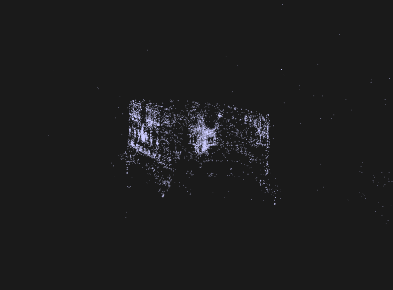

# Structure-from-Motion (SfM) Pipeline for Local Feature Matching

This project implements a modular Structure-from-Motion pipeline to recover camera poses and reconstruct a sparse 3D point cloud from a series of images. It leverages SIFT for feature detection, FLANN for feature matching, and OpenCV for pose estimation and triangulation. The final 3D reconstruction is visualized using Open3D and exported as a PLY file, making it compatible with tools like MeshLab.



## Pipeline Overview

- **Feature Detection & Matching**  
  Utilizes SIFT for robust keypoint detection and descriptor extraction, and employs a FLANN-based matcher with a ratio test (0.4 threshold) to retain only the most reliable matches.

- **Camera Pose Recovery**  
  Computes relative camera poses using the Essential Matrix for the first image pair. For subsequent images, it recovers rotation and translation via the PnP algorithm using 2D–3D correspondences (requiring at least six good matches). Rotation vectors are converted into rotation matrices using `cv2.Rodrigues`.

- **3D Reconstruction & Triangulation**  
  Forms projection matrices by combining the recovered camera poses with the intrinsic calibration matrix (provided in `K.txt`), then triangulates matched features across image pairs to reconstruct 3D points.

- **Visualization & Export**  
  Provides an interactive 3D view of the reconstructed scene using Open3D. The final point cloud is exported in PLY format for further visualization or processing.

- **Robustness & Error Handling**  
  Includes comprehensive error checks throughout the pipeline to ensure reliable performance.

## File Structure

- **assignment2.py**: Driver script that initiates the SfM pipeline.  
- **sfm.py**: Contains the core processing logic for Structure-from-Motion.  
- **utils.py**: Provides utility functions for file handling and other auxiliary tasks.  
- **images/**: Directory containing all input images.  
- **K.txt**: File containing the camera calibration matrix.

## Running Instructions

1. **Generate the Point Cloud**  
   Execute the pipeline by running:
   ```bash
   python3 assignment2.py
This command processes the images and produces a PLY file (e.g., mycloud.ply).

2. **Visualize the Reconstructed Point Cloud**

    To view the generated point cloud, run:
    ```bash
    python3 showcloud.py mycloud.ply

The resulting visualization should named mycloud.ply automattically and look similar to the samplecloud.ply:

## Detailed Pipeline Description

### Modular Design
The code is split into three main files for clarity and maintainability:
- **assignment2.py** serves as the main driver.
- **sfm.py** handles the Structure-from-Motion processing.
- **utils.py** contains utility functions for supporting tasks such as file I/O.

### Calibration & Feature Extraction

**Calibration:**  
The intrinsic parameters of the camera are loaded from `K.txt`.

**Feature Extraction:**  
SIFT is used to detect keypoints and compute descriptors for each image.

### Feature Matching

**Matching Approach:**  
A FLANN-based matcher is used to find the two best matches for each keypoint between image pairs.

**Ratio Test:**  
Only matches where the best match’s distance is less than 0.4 times that of the second-best are retained, ensuring that only strong correspondences are used.

### Pose Estimation

**First Image Pair:**  
The Essential Matrix is computed to recover the initial camera pose.

**Subsequent Images:**  
2D–3D correspondences are established, and the PnP algorithm is used to determine camera rotation and translation. The rotation vectors are then converted to matrices using `cv2.Rodrigues`.

### Triangulation & 3D Reconstruction

**Projection Matrix Formation:**  
Projection matrices are constructed by combining each camera’s rotation matrix and translation vector with the calibration matrix.

**Triangulation:**  
Adjusted 2D point sets are passed to `cv2.triangulatePoints`, yielding 4D homogeneous coordinates that are normalized to obtain 3D points.

**Point Cloud Generation:**  
The resulting 3D coordinates form a sparse point cloud representing the scene.

### Design Challenges

**Point Cloud Centering:**  
Centering the final PLY file can be challenging. Despite adjustments (e.g., tweaking the z-offset and sphere radius), some manual zooming and panning might be necessary to properly view the structure.

**Open3D Integration:**  
Initial segmentation faults with Open3D were resolved by downgrading numpy and Open3D, though a warning like "WARNING Cocoa failed to get service port for display" may still appear.

### Bonus Features

**Multi-View Stereo (MVS) and Bundle Adjustment:**  
These advanced features were considered but not implemented due to time constraints.

### References

- [SIFT Interest Point Detector using Python & OpenCV](https://www.geeksforgeeks.org/sift-interest-point-detector-using-python-opencv/)
- [OpenCV FLANN Matcher Tutorial](https://docs.opencv.org/4.x/dc/dc3/tutorial_py_matcher.html)
- [Perspective-n-Point (PnP) on Wikipedia](https://en.wikipedia.org/wiki/Perspective-n-Point)
- [OpenCV solvePnP Documentation](https://docs.opencv.org/4.x/d5/d1f/calib3d_solvePnP.html)
- [OpenCV Calib3d Module](https://docs.opencv.org/4.5.5/d9/d0c/group__calib3d.html#gad3fc9a0c82b08df034234979960b778c)
- [Structure-From-Motion on GitHub](https://github.com/MayankD409/Structure-From-Motion/blob/main/func.py)
- [Using cv2.triangulatePoints – StackOverflow Discussion](https://stackoverflow.com/questions/16295551/how-to-correctly-use-cvtriangulatepoints?rq=3)
- [Open3D Getting Started Guide](https://www.open3d.org/docs/release/getting_started.html)


